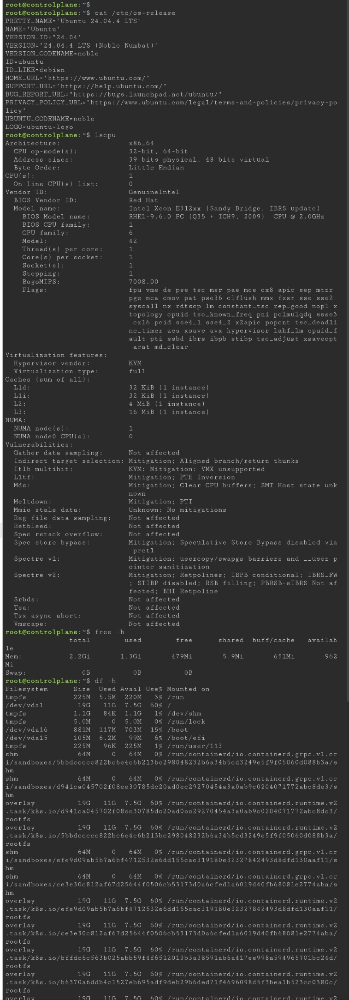

# Laboratory 3: Multi-Cloud Explorer

## Overview
This laboratory covers an in-depth evaluation of AWS, Microsoft Azure, and GCP, analyzing core infrastructure capabilities, architectural equivalence, client scenario matching, and Linux VM hosting options.

---

## Linux System Inspection (KillerCoda)

### Terminal Information Summary
* **Operating System:** Ubuntu / Linux Environment
* **CPU Information:** x86_64 Architecture (Multi-core virtual CPU)
* **Memory (RAM):** ~2GB to 4GB system RAM
* **Disk Space:** Standard root partition storage allocation (~10GB-20GB storage)

### Cloud Hosting Equivalent Services
If this Linux environment were migrated into the cloud, it could be hosted using:
* **AWS:** Amazon EC2 (Elastic Compute Cloud) instance using an Ubuntu Linux AMI.
* **Azure:** Azure Virtual Machine running an Ubuntu OS image.
* **GCP:** Google Compute Engine (GCE) custom VM running Ubuntu Linux.
* 
