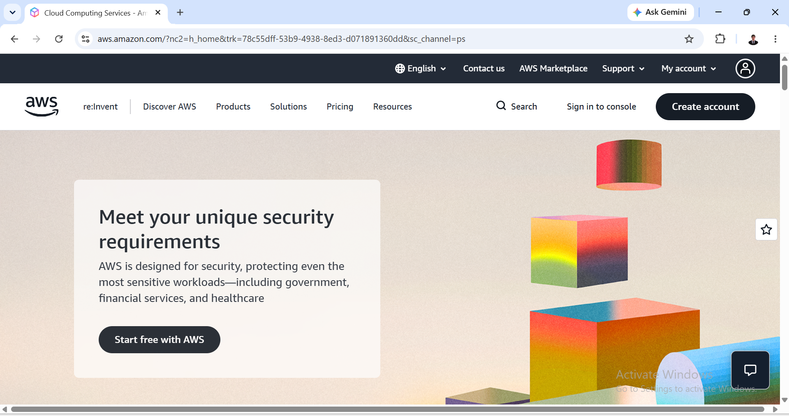

# Amazon Web Services (AWS) Research

## Brief Overview
Amazon Web Services (AWS) is a comprehensive and broadly adopted cloud platform offering over 200 fully featured services from data centers globally. Launched in 2006, AWS leads the cloud infrastructure market in scale and service maturity.

## Global Infrastructure
AWS operates in over 30 geographic Regions worldwide, each containing multiple isolated and physically separated Availability Zones (AZs) connected through low-latency, high-throughput, and highly redundant networking.

## Cloud Management Console
The AWS Management Console provides a web-based portal to access, control, and manage AWS resources, backed by mobile app access, AWS CLI, and extensive SDKs for programmatic control.

## Core Services
* **Amazon EC2:** Resizable compute capacity in the cloud (Virtual Machines).
* **Amazon S3:** Scalable object storage for data backup, archiving, and analytics.
* **AWS Lambda:** Serverless compute service running code in response to events.
* **Amazon VPC:** Isolated virtual network environment to launch AWS resources.

## Advantages
* Market-leading maturity, community size, and extensive documentation.
* Massive ecosystem of third-party integration tools and partner solutions.
* Deepest set of features within individual services.

## Enterprise Use Cases
* Scalable web app hosting and e-commerce platforms.
* Big Data analytics and data warehousing.
* Enterprise application migration and hybrid cloud infrastructure.
* 
