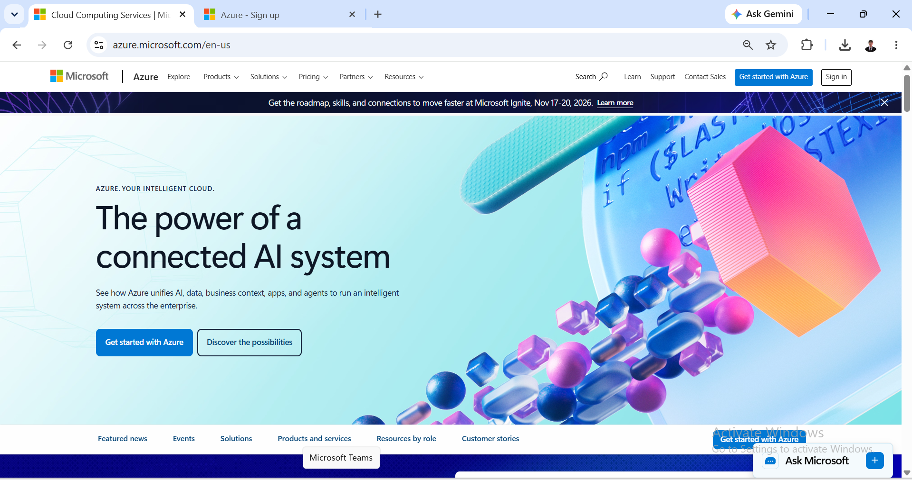

# Microsoft Azure Research

## Brief Overview
Microsoft Azure is a public cloud computing platform providing IaaS, PaaS, and SaaS solutions. It launched in 2010 and is particularly strong for organizations heavily invested in Microsoft enterprise ecosystems.

## Global Infrastructure
Azure has a global presence across more than 60 regions worldwide, connected via one of the largest interconnected fiber networks in the world, prioritizing compliance and local data sovereignty.

## Cloud Management Console
The Azure Portal features a configurable dashboard interface (using customizable "blades") to manage resources, monitor costs, and manage Identity and Access via Microsoft Entra ID.

## Core Services
* **Azure Virtual Machines:** On-demand Linux and Windows VM infrastructure.
* **Azure Blob Storage:** Massively scalable object storage for unstructured data.
* **Azure App Service:** PaaS solution for hosting web apps and RESTful APIs quickly.
* **Azure Virtual Network (VNet):** Private network environment for Azure resources.

## Advantages
* Seamless native integration with Microsoft 365, Active Directory, and Windows Server.
* Hybrid cloud capabilities through Azure Arc and Azure Stack.
* Attractive cost savings for enterprise Windows and SQL Server licensing (Azure Hybrid Benefit).

## Enterprise Use Cases
* Hybrid cloud deployments for legacy enterprise infrastructure.
* Enterprise Identity and Access Management migration.
* Corporate productivity and web application hosting.
* 
