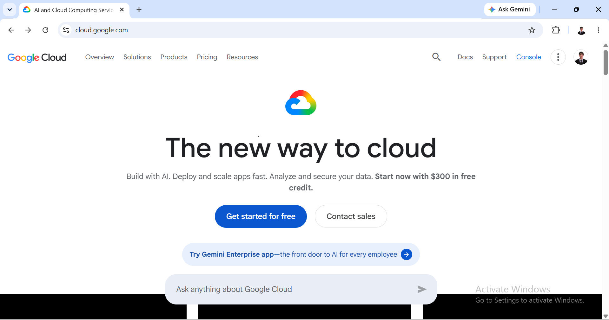

# Google Cloud Platform (GCP) Research

## Brief Overview
Google Cloud Platform (GCP) is a suite of cloud services offered by Google. Launched in 2008, GCP leverages Google's internal infrastructure to excel in containerization, data analytics, and artificial intelligence.

## Global Infrastructure
GCP operates across 35+ regions worldwide, interconnected by a high-speed private global network, minimizing latency and maximizing network throughput for global services.

## Cloud Management Console
The Google Cloud Console provides an intuitive visual UI, integrated directly with Cloud Shell, a pre-configured browser-based command-line terminal with full SDK toolsets built-in.

## Core Services
* **Google Compute Engine (GCE):** High-performance customizable VMs.
* **Google Cloud Storage (GCS):** Unified object storage for live or archived data.
* **Google Kubernetes Engine (GKE):** Managed environment for deploying containerized applications.
* **BigQuery:** Fully managed, serverless data warehouse for enterprise-scale analytics.

## Advantages
* Pioneer and leader in Kubernetes and container orchestration environments.
* Industry-leading capabilities in Artificial Intelligence, Machine Learning, and Big Data.
* Highly cost-efficient network backbone and custom VM pricing models.

## Enterprise Use Cases
* AI/ML model training and deployment at scale.
* High-throughput data analytics and real-time processing pipelines.
* Modern microservices and cloud-native containerized applications.
* 
